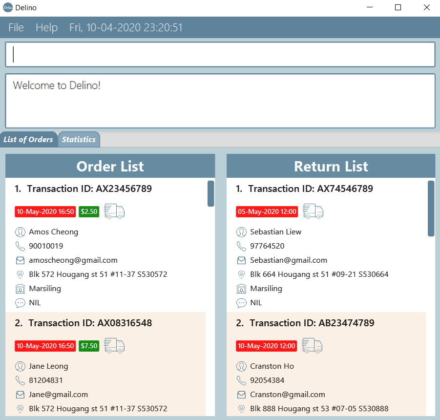
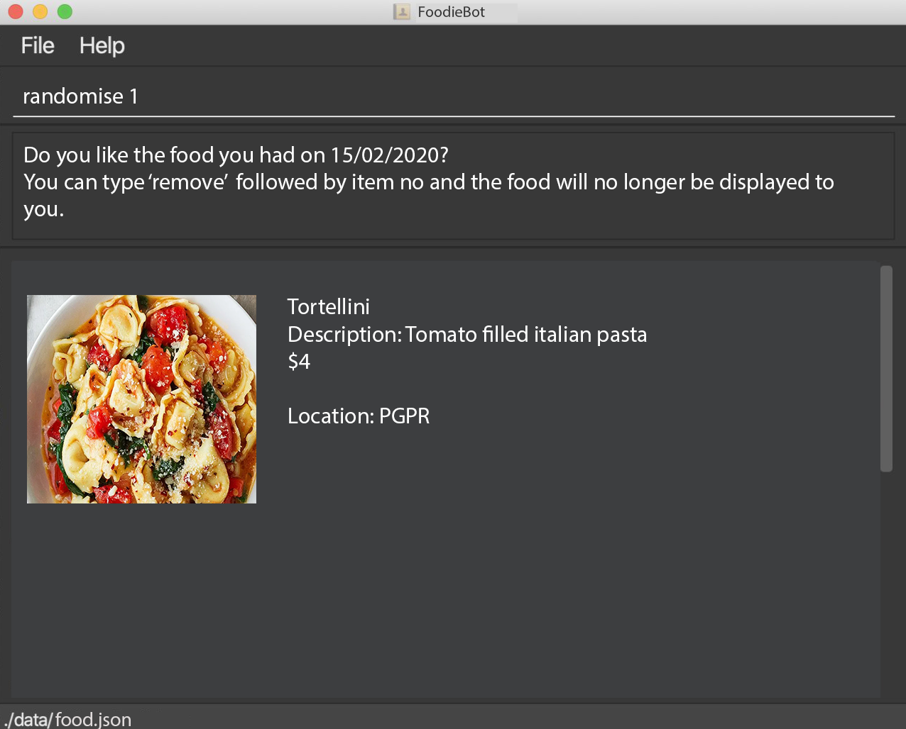

= Inventory Manager
ifdef::env-github,env-browser[:relfileprefix: docs/]

https://travis-ci.org/AY1920S2-CS2103-W14-2/main[image:https://travis-ci.org/AY1920S2-CS2103-W14-2/main.svg?branch=master[Build Status]]
https://ci.appveyor.com/project/CS2103-W14-2/main[image:https://ci.appveyor.com/api/projects/status/rlr0xji2vhij1016?svg=true[Build status]]
https://coveralls.io/github/AY1920S2-CS2103-W14-2/main?branch=master[image:https://coveralls.io/repos/github/AY1920S2-CS2103-W14-2/main/badge.svg?branch=master[Coverage Status]]

ifdef::env-github[]

endif::[]

ifndef::env-github[]

endif::[]

* This is a desktop Inventory Manager application. It has a GUI but most of the user interactions happen using a CLI (Command Line Interface).
* It facilitates easily management of stocks, which includes:
    ** warning when supplies are
    low
    ** easy sourcing of suppliers for selected goods
    ** expiry management
    ** seamless updating of inventory upon procurement and sales transactions
* This application is optimized for fast-typists. If you are comfortable with the keyboard,
Inventory Manager will be a joy to use!

== Site Map

* <<UserGuide#, User Guide>>
* <<DeveloperGuide#, Developer Guide>>
* <<AboutUs#, About Us>>
* <<ContactUs#, Contact Us>>

== Acknowledgements

* Some parts of this sample application were inspired by the excellent http://code.makery.ch/library/javafx-8-tutorial/[Java FX tutorial] by
_Marco Jakob_.
* Libraries used: https://openjfx.io/[JavaFX], https://github.com/FasterXML/jackson[Jackson], https://github.com/junit-team/junit5[JUnit5]
* This project is an extension of AddressBook-Level3 project codebase created by https://se-education.org[SE-EDU initiative]

== Licence : link:LICENSE[MIT]
