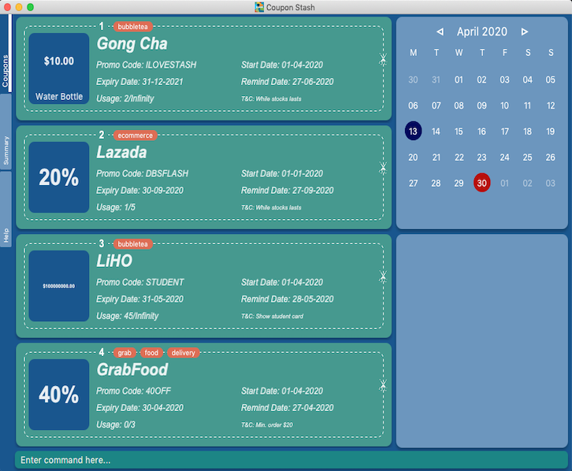

= Naggy Joel
ifdef::env-github,env-browser[:relfileprefix: docs/]

https://travis-ci.org/AY1920S2-CS2103-W14-3/main[image:https://travis-ci.org/AY1920S2-CS2103-W14-3/main.svg?branch=master[Build Status]]
https://ci.appveyor.com/project/damithc/addressbook-level3[image:https://ci.appveyor.com/api/projects/status/3boko2x2vr5cc3w2?svg=true[Build status]]
https://coveralls.io/github/AY1920S2-CS2103-W14-3/main?branch=master[image:https://coveralls.io/repos/github/AY1920S2-CS2103-W14-3/main/badge.svg?branch=master[Coverage Status]]
https://www.codacy.com/app/damith/addressbook-level3?utm_source=github.com&utm_medium=referral&utm_content=se-edu/addressbook-level3&utm_campaign=Badge_Grade[image:https://api.codacy.com/project/badge/Grade/fc0b7775cf7f4fdeaf08776f3d8e364a[Codacy Badge]]

ifdef::env-github[]

endif::[]

ifndef::env-github[]
image::images/Ui.png[width="600"]
endif::[]

* This is a desktop Social Life Management application that has a GUI but most of the user interactions happen using a CLI (Command Line Interface).
* It aims to help you manage all aspects of your social life, ranging from your contacts to your tasks at hand and where is a good hangout spot.
* It helps you be the best friend that you can ever be!

== Site Map

* <<UserGuide#, User Guide>>
* <<DeveloperGuide#, Developer Guide>>
* <<AboutUs#, About Us>>
* <<ContactUs#, Contact Us>>

== Acknowledgements

* Some parts of this sample application were inspired by the excellent http://code.makery.ch/library/javafx-8-tutorial/[Java FX tutorial] by
_Marco Jakob_.
* Original source of the code: AddressBook-Level3 project created by SE-EDU initiative, https://se-education.org
* Libraries used: https://openjfx.io/[JavaFX], https://github.com/FasterXML/jackson[Jackson], https://github.com/junit-team/junit5[JUnit5]

== Licence : link:LICENSE[MIT]
