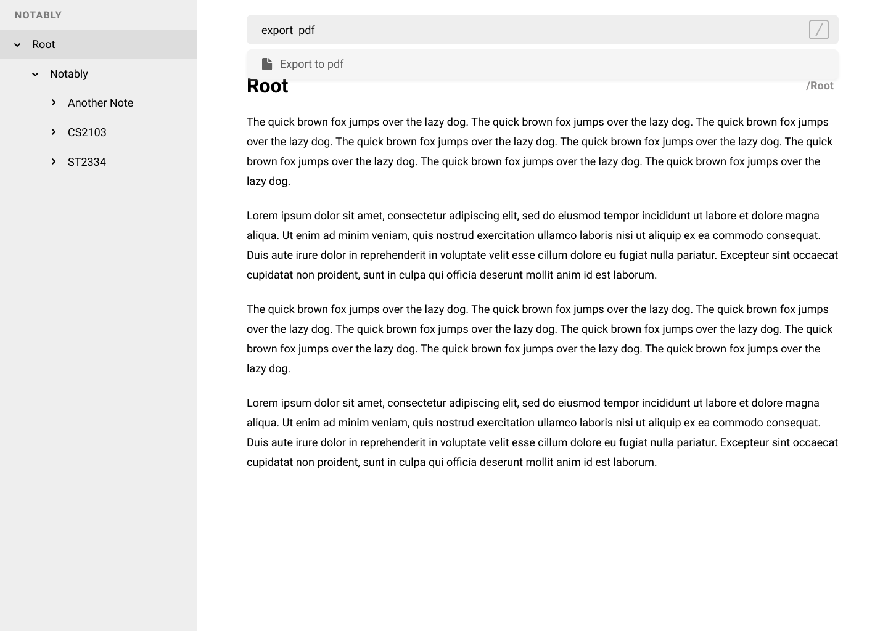

= Notably - User Guide
:site-section: UserGuide
:toc:
:toc-title:
:toc-placement: preamble
:sectnums:
:imagesDir: images
:stylesDir: stylesheets
:xrefstyle: full
:experimental:
ifdef::env-github[]
:tip-caption: :bulb:
:note-caption: :information_source:
endif::[]
:repoURL: https://github.com/AY1920S2-CS2103T-W17-2/main

By: `Team Notably`      Since: `Feb 2020`      Licence: `MIT`

== Introduction

Notably is for those who *prefer to use a desktop app for managing notes*. More importantly, Notably is *optimized for those who prefer to work with a Command Line Interface* (CLI) while still having the benefits of a Graphical User Interface (GUI). If you can type fast, Notably can get your notes taken down faster than traditional GUI apps.

== Quick Start [Work in progress]

.  Ensure you have Java `11` or above installed in your Computer.
.  Download the latest `notably.jar`
.  Copy the file to the folder you want to use as the home folder for your notes.
.  Double-click the file to start the app. The GUI should appear in a few seconds.
+
image::View.png[width="790"]
+
.  Type the command in the command box and press kbd:[Enter] to execute it. +
e.g. typing *`help`* and pressing kbd:[Enter] will open the help window.

== Features

====
*Command Legend*

* Words in `UPPER_CASE` are the parameters to be supplied by the user e.g. in `open NAME`, `NAME` is a parameter which can be used as `open Notably`.
* Items in square brackets are optional e.g `-t TITLE [-b BODY]` can be used as `-t Notably -b Lorem ipsum` or as `-t Notably`.
* Parameters can be in any order e.g. if the command specifies `-t TITLE -b BODY`, `-b BODY -t TITLE` is also acceptable.
====

=== View help : `help`

Notably will display the list of features and commands available as well as their uses. +
Format: `help`

=== Exit the program: `exit`

Exits the program. +
Format: `exit`

=== Create a new note: `new`

You can create a new note in your current working directory. +
Format: `new -t TITLE [-b BODY] [-o]` +
Example: `new -t Notably -b Lorem ipsum dolor sit amer -o`

=== Open an existing note: `open`

You can open an existing note by specifynig its title. A slash `/` character can be used to denote a filesystem-like hierarchy. +
Format: `open [-t] TITLE` +
Example: `open -t Notably/CS2103`

=== Edit an existing note: `edit`

Edits body paragraph of the current note. This command replaces the current content of a note with the newly specified body. +
Format: `edit -b BODY`
Example: `edit -b This is the new body paragraph`

=== Find a note based on certain keywords: `search`

Searches all the notes saved in Notably for the keyword. +
Format: `search [-s] KEYWORD` +
Example: `search -s CS2103`

=== Delete a note: `delete`

If you no longer need a note, or accidentally create a wrong one, don't worry. You can always delete your note. A slash `/` character can be used to denote a filesystem-like hierarchy. +
Format: `delete [-t] TITLE` +
Example: `delete -t Notably/CS2103`

=== Export a note: `export`

You can export a note into other formats. +
Format: `export [-t] TYPE` +
Example: `export -t PDF`

=== Save the data

Notes data are saved in the hard disk automatically after any command that changes the data. +
There is no need to save manually.

=== Auto suggestions

Suggestions will be provided as commands are being filled in. For clarity, see the mockups below.

=== Auto correct

Mistypes, as long as they are not too far away from available commands, will be accepted. This will give the user a more fluid typing experience.

== FAQ

*Q*: How do I transfer my data to another Computer? +
*A*: Install the app in the other computer and overwrite the empty data file it creates with the file that contains the data of your previous Notably folder.

== Command Summary

* *View help*: `help`
* *Exit the program*: `exit`
* *Create a new note*: `new -t TITLE [-b BODY] [-o]`
* *Open an existing note*: `open [-t] TITLE`
* *Edit an existing note*: `edit -b BODY`
* *Find a note based on certain keywords*: `search [-s] KEYWORD`
* *Delete a note*: `delete [-t] TITLE`
* *Export a note*: `export [-t] TYPE`
* *Go back to the parent note*: `open ../`
* *Navigate to a specific directory*: `open [-t] TITLE`
* *Autofill*: kbd:[Tab]

== Demo/Mock up

=== Note creation

. The current note is highlighted at the sidebar; it is titled "Root".
+
image::Create1.png[width="790"]
+
. Next, let's create a new note with the command `new -t TITLE [-b BODY] [-o]`.
. The `-o` portion allows the user to change his/her directory to that of the newly created note. See Section 3.3 for more details.
+
image::Create2.png[width="790"]
+
. Notably is now the current directory as highlighted in the sidebar.
. Next, let's attempt to create another note titled "CS2103T"
+
image::Create3.png[width="790"]
+
. User can go back to the parent note with the command `open ../`.
+
image::Create4.png[width="790"]
+
. We will end up in the note titled "Notably".
+
image::Create5.png[width="790"]
+

=== Navigation

. `open [-t] TITLE` to navigate to a specific directory.
. Users can use kbd:[Tab] key to autofill the command recommended by the command line.
+
image::Navigation.png[width="790"]
+

=== Export to other types

. Users can export notes to other types using the `export [-t] TYPE` command.
+

+

=== Search

. Users can search for the note that contains a specific keyword by using the `search [-k] KEYWORD` command.
+
image::Search.png[width="790"]
+

