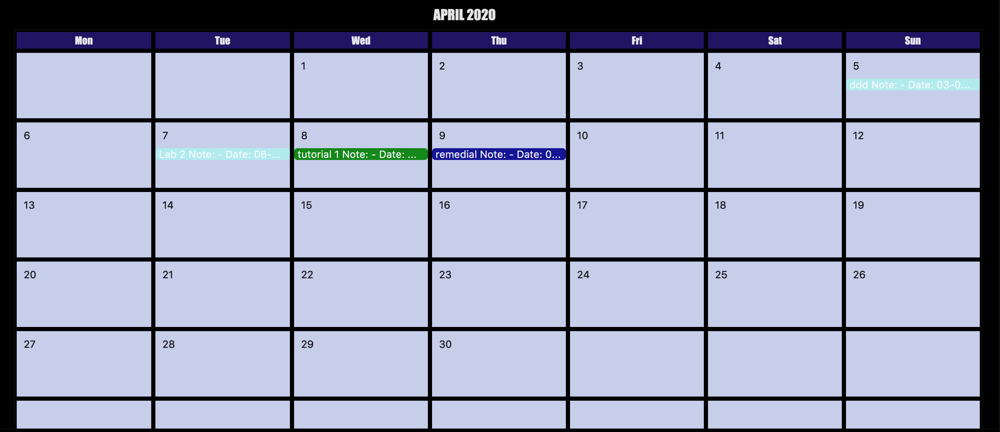

= Nice & Amazing Student Guide (NASA) - User Guide
:site-section: UserGuide
:toc:
:toc-title:
:toc-placement: preamble
:sectnums:
:imagesDir: images
:stylesDir: stylesheets
:stylesheet: userguide.css
:linkcss:
:xrefstyle: full
:experimental:
ifdef::env-github[]
:tip-caption: :bulb:
:note-caption: :information_source:
endif::[]
:repoURL: https://github.com/AY1920S2-CS2103T-T10-4/main

By: `CS2103T-T10-4`      Since: `Feb 2020`      Licence: `NUS`

== Introduction
Nice & Amazing Student Assistant (NASA) is an application for *busy university students to manage their module
assignments, lessons, exams and other miscellaneous activities.*

*While NASA has a user-centric Graphical User Interface, it is optimized for users who prefer to work with the
Command Line Interface (CLI).* If you can type fast, NASA can keep track of all your module activities faster than
traditional GUI applications.

Interested? Ready to blast off on an exciting student journey? Jump to the <<Quick Start>> to get started!

== Quick Start

.  Ensure you have Java `11` or above installed in your Computer.
// suppress inspection "AsciiDocLinkResolve"
.  Download the latest `NASA.jar` link:{repoURL}/releases[here].
.  Copy the file to the folder you want to use as the home folder for your Address Book.
.  Double-click the file to start the app. The GUI should appear in a few seconds.
+
image::Ui.png[width="790"]
+
.  Type the command in the command box and press kbd:[Enter] to execute it. +
e.g. typing *`help`* and pressing kbd:[Enter] will open the help window.
.  Some example commands you can try:

* *`list`* : lists all activities of each module
* **`add`**`m/CS2103T n/Software Engineering`: adds a module CS2103T `Software Engineering` to the list. Allows activities to be added to that module.
* **`deadline m/CS2103T d/20-02-2020 23:59 t/IP Project p/2 n/Must get an executable JAR file` : adds an activity called IP Project with the following details into CS2103T module activity-list.
* **`delete`**`1 m/CS2103T` : deletes the 1st activity shown in the module activity-list.
* *`exit`* : exits the app

.  Refer to <<Features>> for details of each command.

[[Features]]
== Features

=== Keyboard shortcuts

Navigate around NASA using the following keyboard shortcuts.

[%header,cols=2*]
|===
|Shortcut
|Action

|Ctrl + Z
|Undo last action.

|Ctrl + Shift + Z
|Redo last action.

|Tab
|Switch between tabs.

|Up arrow key
|View previous command.

|Down arrow key
|View next command.
|===

====
*Command Format*

* Words in `UPPER_CASE` are the parameters to be supplied by the user e.g. in `Madd m/MODULE_CODE`, `MODULE_CODE` is a parameter which can be used as `Madd m/CS1231`.
* Items in square brackets are optional e.g `[n/Notes]`.
* Items with `…`​ after them can be used multiple times including zero times e.g. `[m/MODULE_CODE]...` means m/CS2103T CS2101 .....
* Parameters can be in any order.
* Commands are **non case-sensitive**, unless stated otherwise.
====

=== Viewing help : `help`

Format: `help`

=== Adding a module activity-list: `add`

Adds a module activity-list into the NASA application +
Format: `add m/MODULE_CODE n/MODULE_NAME`

Examples:

* `add m/CS2030 n/Programming Methodology II`
* `add m/CS1231 n/Discrete Structures in Mathematics`

=== Adding a activity into a module activity-list: `TYPE_OF_ACTIVITY`
Adds an activity into the specified module activity-list +
Types of activities available and how to add them are shown in the table below.

|===
| Type of activity | Description | Format | Example
| Deadline | Deadline are activities that need to be completed before a specific deadline | `deadline m/MODULE_CODE d/DATE a/ACTIVITY_NAME [p/PRIORITY] [n/NOTES] | deadline m/CS1020 d/20-05-2020 23:59 a/Assignment 1 p/1 n/Watch lecture 3 and 4 before doing`
| Lessons  | Lessons are essentially tutorials and lectures that has a duration and are fixed in schedule | `lesson m/MODULE_CODE sd/START_DATE ed/END_DATE [p/PRIORITY] [n/NOTES] | `lesson m/CS1020 a/Tutorial sd/20-05-2020 23:00 ed/20-05-2020 23:59`
| Events | Events are other activities that has a duration (eg: remedial, examinations, consultations) | `event m/MODULE_CODE sd/START_DATE ed/END_DATE [p/PRIORITY] [n/NOTES]` | `event m/CS2030 sd/20-05-2020 23:00 ed/20-05-2020 23:59 p/1`
|===

[NOTE]
====
** It is not allowed to add deadlines past their due dates.
** Similar to deadlines, it is not allowed to add events and lessons that already passed.
** Priority has values from 1 to 5, where 1 indicates highest priority and 5 indicates lowest priority.
** If priority is not specified, the default priority of the activity is set to 1 (highest priority).
====

=== Listing all activities : `list`

Shows a list of activities +
Format: `list [m/MODULE_CODE....]`

* If no module code is specified, all the module's activity-list will be shown
* It is possible to add multiple module_codes and display all their relevant activity-lists.

// tag::edit[]
=== Editing a module: `edit`

Edits an existing module in the NASA application. +
Format: `edit m/CS2030 [m/MODULE_CODE] [n/MODULE_NAME]`

****
* Edits an existing module in the application.
* First `m/` is taken as the module code of the existing module to be edited.
* To edit module code, EXACTLY two `m/` tag must be entered.
* At least one of the optional fields must be provided.
* Existing values will be updated to the input values.
****

Examples:
* `edit m/CS2030 m/CS2030S n/Programming Methodology for CS` +
Edits the CS2030 module to CS2030S along with its new module name.

=== Editing a deadline : `edit-d`

Edits an existing deadline in the module's deadline list. +
Format: `edit-d INDEX m/MODULE_CODE [a/ACTIVITY_NAME] [d/DUE DATE] [p/PRIORITY] [n/NOTES]`

****
* Edits the deadline at the specified `INDEX` in the specified `MODULE_CODE` deadline-list. The index refers to the index number shown in the module deadline-list. The index *must be a positive integer* 1, 2, 3, ...
* At least one of the optional fields must be provided.
* Existing values will be updated to the input values.
****

Examples:

* `edit-d 2 m/CS2103T d/12-12-2020 23:59` +
Edits the 2nd deadline in CS2013T deadline-list date to be `12-12-2020 23:59`.
* `edit-d 3 m/CS2030 n/Finish LAB level 3 with Generics p/2` +
Edits the notes and priority of the 3rd deadline in CS2030 deadline-list to `Finish LAB level 3 with Generics` and `2` respectively.

=== Editing an event : `edit-e`

Edits an existing event in the module's event list. +
Format: `edit-e INDEX m/MODULE_CODE [a/ACTIVITY_NAME] [sd/START DATE] [ed/END DATE] [n/NOTES]`

****
* Edits the event at the specified `INDEX` in the specified `MODULE_CODE` event-list. The index refers to the index number shown in the module event-list. The index *must be a positive integer* 1, 2, 3, ...
* At least one of the optional fields must be provided.
* Existing values will be updated to the input values.
****

Examples:

* `edit-e 2 m/CS2103T ed/12-12-2020 23:59` +
Edits the 2nd event in CS2103T event-list end date to be `12-12-2020 23:59`.
* `edit-e 3 m/CS2030 n/Practical exam sd/20-05-2020` +
Edits the notes and start date of the 3rd event in CS2030 event-list to `Practical exam` and `20-05-2020 23:59` respectively.
// end::edit[]

=== Locating modules by name: `find`

Finds activities whose names contain any of the given keywords. +
Format: `find a/KEYWORD [MORE_KEYWORDS]`

****
* The search is case insensitive. e.g `tutorial` will match `TUTORIAL`
* The order of the keywords does not matter. e.g. `Lab 3` will match `3 Lab`
* Only the taskname is searched.
* Only full words will be matched e.g. `tutorial` will not match `tutorials`
* Persons matching at least one keyword will be returned (i.e. `OR` search). e.g. `tutorial lab` will return `tutorial 2`, `lab 3`
****

Examples:

* `find a/tutorial` +
Returns `tutorial 1` and `tutorial 2` and any other activities with name tutorial.

// tag::delete[]
=== Deleting a activity : `delete`

Deletes the specified activity from module activity-list. +
Format: `delete INDEX m/MODULE_CODE`

****
* Deletes the activity at the specified `INDEX` in the specified `MODULE_CODE`.
* `INDEX` must be specified first before the `MODULE_CODE`
* The index refers to the index number shown in the activity-list.
* The index *must be a positive integer* 1, 2, 3, ...
****

Examples:

*`delete 2 m/CS2030` +
Deletes the 2nd activity in the CS2030 module activity-list.

=== Deleting a module: `mdelete`
Deletes a module along with its activity-list. +
Format: `mdelete m/MODULE_CODE`

** Deletes the module with MODULE_CODE and also its activity-list
** MODULE_CODE must be an existing module

Examples:

** `mdelete m/CS2030` +
Deletes the respective CS2030 module.
// end::delete[]

=== Creating shortcuts: `shortcut` `[coming in v2.0]`
Creates a shortcut for specified activity. +
Format: `shortcut s/SHORTCUT c/COMMAND`

** Creates a `SHORTCUT` to the specified `COMMAND`.
** Can only add `SHORTCUT` to an existing `COMMAND`.
** Can add multiple `SHORTCUT` for a specific `COMMAND`.
** A `SHORTCUT` will be generated that is unique for a `COMMAND`.

Examples:

** `shortcut s/l c/list` +
Adds a shortcut "l" to command list. "l" can now be used in place of list.

=== Generating statistics
Displays statistics of all activities.

Switch to statistics tab either

    1) using the TAB key

    2) using the command `statistics`

Format: `statistics`

*View statistics for specific activity type*

Format: `statistics at/[TYPE_OF_ACTIVITY]`

Customising statistics parameters `[coming in v2.0]`
** Can add `TYPE_OF_ACTIVITY` to filter statistics by activity type.

Examples:

** `statistics at/deadline` +
Displays statistics for all deadline activities.

=== Automating activity: `repeat`  [coming in v2.0]
Allows user to repeat an activity from a module.
Format: `repeat m/MODULE_CODE a/ACTIVITY_NAME r/INDEX`

** `INDEX` can be in `1 for Weekly`, `2 twice Weekly`, `3 for Monthly`.
**  By default `INDEX` will be `0` hence no automation will be done.
**  The activity will be regenerated once user open the application.

Examples:

** `repeat m/CS3233 a/SEA Group Programming Assignment r/0` to cancel.
** `repeat m/CS3233 a/SEA Group Programming Assignment r/1` to regenerate weekly.
** `repeat m/CS3233 a/SEA Group Programming Assignment r/2` to regenerate twice weekly.
** `repeat m/CS3233 a/SEA Group Programming Assignment r/3` to regenerate monthly.

=== Quote: `quote` [coming in v2.0]
Allows user to generate a quote message. Aims to lighten the user day!
Format: `quote`

Example :

** `quote` : “Limitations live only in our minds. But if we use our imaginations, our possibilities become limitless.” – Jamie Paolinetti

=== Undo: `undo`
Allows user to undo previous action.
Format: `undo`

Example :

** `undo` : "undo last action"

=== Redo: `redo`
Allows user to redo previous action.
Format: `redo`

Example :

** `redo` : "redo last action" else "no last action to redo"

=== Calendar View
Allows the user to see the activities onto a calendar.

* Switch to calendar tab using TAB key.

Examples:

// tag::sort[]
=== Sort deadlines `sort`
Sorts all deadlines in their respective modules by a specified criteria. +
Format: `sort SORT METHOD`

The list of sort methods is given below: +
|===
|*Sort Method* |*Format* |*Sort order (top to bottom)*
|Lexicographical order (case-insensitive) |`sort name` | A to Z
|Due date |`sort date` | Earliest to latest
|Priority |`sort priority`| Highest (5) to lowest (1)
|===
// end::sort[]

=== Clearing all entries : `clear`

Clears all entries from the NASA application (including module activity-lists created). +
Format: `clear`

// tag::export[]
=== Export NasaBook as QR code : `export`

Exports all deadlines and events in NasaBook as a QR-code text, compatible with QR code enabled scanners and smartphones. +
Format: `export`
// end::export[]

=== Exiting the program : `exit`

Exits the program. +
Format: `exit`

=== Saving the data

NASA data are saved in the hard disk automatically after any command that changes the data. +
There is no need to save manually.

// tag::dataencryption[]
=== Encrypting data files `[coming in v2.0]`

_{explain how the user can enable/disable data encryption}_
// end::dataencryption[]

// tag::faq[]
== FAQ

*Q*: How do I transfer my data to another Computer? +
*A*: Install the app in the other computer and overwrite the empty data file it creates with the file that contains
the data of your previous NASA folder.

*Q*: What is the purpose of an event? +
*A*: An event can be CCAs, bookings, etc.

*Q*: How do I populate NASA with an activity (ie. Deadline, Event, Lesson) that occur regularly (eg. weekly)? +
*A*: Use the automate command (see section ‘Automation’)

*Q*: What are the differences between Deadline and Event? +
*A*: Both are describe the type of activity in a module. They are displayed in different parts of the NASA UI (ie. Deadline and Event panel, respectively)

*Q*: How many modules can I add into NASA? +
*A*: NASA is optimised to display up to 10 modules at once - More than enough modules that a university student will typically take in a semester. Should you exceed 10 modules, please delete existing modules before adding new modules.

*Q*: How many activities can I add into each module? +
*A*: There is no limit, so add away!

*Q*: Since every deadline is different how automation helps to keep track of my new deadline? +
*A*: The new deadline will be base on the interval when you first initialise the deadline activity. For example,
date of creating an activity is on 16-03-2020 00:00 and due date is on 20-03-2020 00:00. If you set repeat for a week,
the next due date will be 16 + 7 + 4 which is 27-03-2020 00:00.

*Q*: There is an unreported bug. What should I do? +
*A*: Please contact us here! We will respond as soon as possible.
// end::faq[]

== Command Summary
=======
.List of all commands
[cols="1,3"]
|===
|Command|Syntax

| *Add* |`add m/MODULE_CODE n/MODULE_NAME`
| *Deadline/Event/Lesson* |`TYPE_OF_ACTIVITY m/MODULE_CODE d/DATE a/ACTIVITY_NAME [p/PRIORITY] [n/NOTES]`
| *Clear* | `clear`
| *Delete* | `delete m/MODULE_CODE INDEX`
| *Delete* | `mdelete m/MODULE_CODE`
| *Edit module* | `edit m/MODULE_CODE [m/MODULE_CODE] [n/MODULE_NAME]`
| *Edit deadline* | `edit-d INDEX m/MODULE_CODE [a/ACTIVITY_NAME] [d/DUE DATE] [p/PRIORITY] [n/NOTES]`
| *Edit event* | `edit-e INDEX m/MODULE_CODE [a/ACTIVITY_NAME] [sd/START DATE] [ed/END DATE] [n/NOTES]`
| *Export* | `export`
| *Find* | `find KEYWORD [MORE_KEYWORDS]`
| *Help* | `help`
| *List* | `list [m/MODULE_CODE...]`
| *Shortcut* | `shortcut s/SHORTCUT c/COMMAND`
| *Sort* | `sort SORT METHOD`
| *Statistics* | `statistics [at/TYPE_OF_ACTIVITY]`
| *Redo* | `redo`
| *Repeat* | `repeat m/MODULE_CODE a/ACTIVITYNAME r/INDEX`
| *Quote* | `quote`
| *Undo* | `undo`
|===
