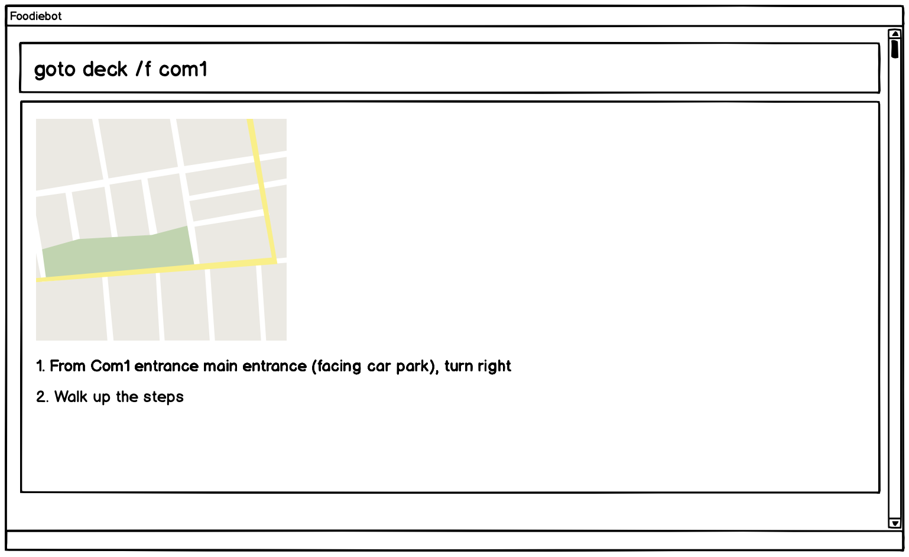
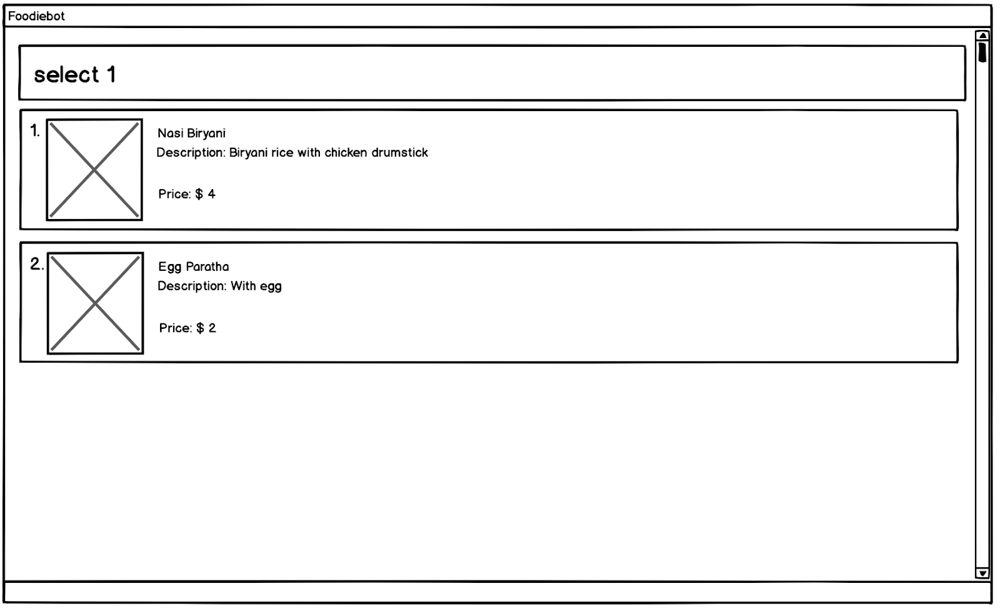
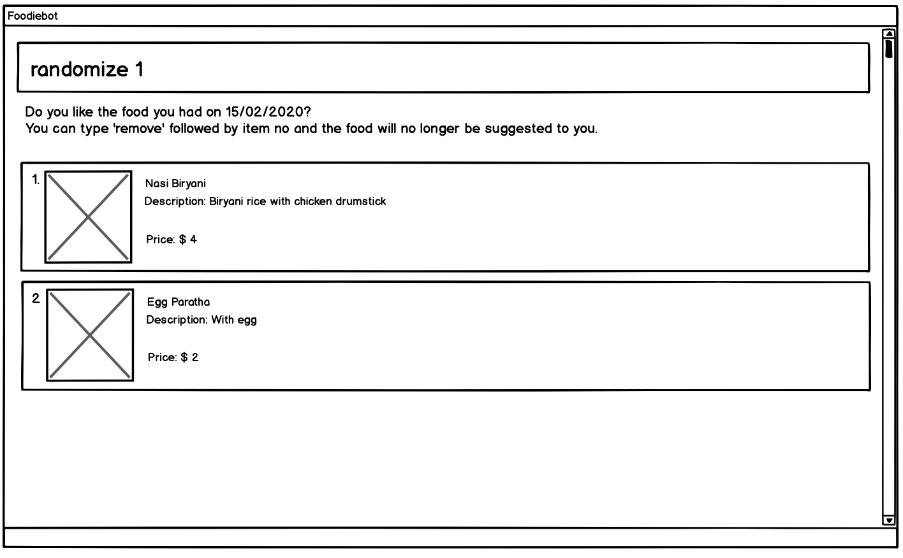
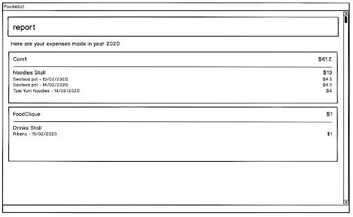

= FoodieBot - User Guide
:site-section: UserGuide
:toc:
:toc-title:
:toc-placement: preamble
:sectnums:
:imagesDir: images
:stylesDir: stylesheets
:xrefstyle: full
:experimental:
ifdef::env-github[]
:tip-caption: :bulb:
:note-caption: :information_source:
endif::[]
:repoURL: https://github.com/AY1920S2-CS2103T-F11-3/main

By: `FoodieBot Team`      Since: `Feb 2020`    Licence: `MIT`

== Introduction

FoodieBot is an all-in-one application to help both people new to NUS and people experienced in NUS with their campus dining needs. Whether the user needs a random suggestion of what to eat, directions to get to the canteen, help planning their budget for the week or just wants to see what each canteen has to offer, FoodieBot is here to provide for your needs.

// insert image to show section of UI attributes/ objects

== About This document
This document shows you how to use the features of FoodieBot.

Note the following symbols and formatting used in this document:

[NOTE]
This symbol indicates important information.

[TIP]
This symbol indicates tips for the particular feature.

`list` - A grey highlight (called a mark-up) indicates that this is a command that can be typed into the command line and executed by the application.

== Quick Start

.  Ensure that you have **Java 11** or above installed in your Computer.
.  Download the latest **foodiebot.jar** link:{repoURL}/releases[here].
.  Copy the file to the folder you want to use as the home folder for your FoodieBot.
.  Double-click the file to start the app. The Graphical User Interface(GUI) similar to the image shown below should appear in a few seconds.

+
image::Ui.png[width="790"]
+
.  Type the command in the command box and press kbd:[Enter] to execute it. +
e.g. typing *`help`* and pressing kbd:[Enter] will open the help window.
.  Some example commands you can try:

* *`list`* : Lists all canteens.
* *`list`*`f/ COM1` : Locate the nearest canteen from COM1.
* *`goto`*`deck f/ COM1` : Display direction to go to deck from COM1.
* *`exit`* : Go back to the previous view, if the application is at the main screen, the exit command will close the application

//.  Refer to <<Features>> for details of each command.

[[Features]]
== Features

====
[red]*Command Format*

* Words in `UPPER_CASE` are the parameters to be supplied by the user e.g. in `budget set w/ AMOUNT`, `AMOUNT` is a parameter which can be used as `budget set w/ 9.50`
* Items in square brackets are optional entries e.g `report [w/DATE]` can be entered as `report [w/ 12-02-2020]` or as `report`.
====

=== List All Canteens: `*list*`

Displays a list of all available canteens on campus.

Format: `list`

* `[f/BLOCK_NAME]` - displays canteens ordered by increasing distance from current location.

Examples:

* `list` +
List all canteens.
* `list f/com1` +
List all canteens starting with the nearest canteen from com1

image::app/list.png[width="700", align="left"]

=== Go to Canteen: `goto`

Displays a map with the route between the starting location and the destination.
Includes instructions on how to travel there as well as bus services that go to the canteen.

Format: `goto CANTEEN_NAME f/ CURRENT_LOCATION`

* Suggestions for the `CANTEEN_NAME` and `CURRENT_LOCATION` field will be provided as the user types.

NOTE: `CANTEEN_NAME` and `CURRENT_LOCATION` field has to be one of the suggestions. Otherwise an error message will be displayed telling the user to provide a valid `CANTEEN_NAME` and `CURRENT_LOCATION`.

=== View All Stores in Canteen: `*enter*`

Displays the stores available at the canteen specified by the user input.

Format: `enter CANTEEN_NAME`

* The display of the store rating is determined from the user's past experiences of the food items which were selected.

=== View Menu of Store : `*menu*`

Displays the menu of the store based on the user input.

Format: `menu KEYWORD`

NOTE: This function is only available after the user has selected a canteen and store.

* User ratings will be displayed if they are available +
E.g. after the user has selected a food item previously.

* `KEYWORD` includes:
** `[by price/ name]`: Sorts the menu accordingly.
** `[tag]`: Displays foods available in the store with the corresponding tag.

Examples:

* `menu western` +
Displays the food that has been tag with western.

image::wireframe/menu.png[width="700", align="left"]

=== Select the Food : `*select*`

Stores the selected food in the database.

Format: `select INDEX`

=== Randomize Food Selection : `*randomize*`

Displays a list of suggestions of food.

Format: `randomize`

=== Set a Budget : `*budget set*`

Sets a daily, weekly or monthly budget. +
The budget can be changed. However, this will reset the budget overview for the current budget cycle.

Format: `budget set [PERIOD] [AMOUNT]`

* `AMOUNT`: Defines the limit of your budget.
* `PERIOD`: Defines the length of each period that the budget is effective for.
* List of `PERIOD` inputs includes:
** `[d/]` - Daily
** `[w/]` - Weekly
** `[m/]` - Monthly

NOTE: `PERIOD` field has to be one of the above suggestions. +
`AMOUNT` field has to be numeric (with or without decimal places). +
Otherwise an error message will be displayed requesting a correct type to be provided.

Examples:

* `budget set w/ 9.50`
** Sets your weekly budget to $9.50.
* `budget set m/ 100`
** Sets your monthly budget to $100.

image::wireframe/budget set.png[width="700", align="left"]

=== View Budget: `*budget view*`

Views the current budget, spendings made for the week and the remaining available budget to spend.

Format: `budget view`

=== View Expense Report: `*report*`

Generates a report for the spending and food purchases for any period specified. +

Formats: `report`

* `[f/FROM_DATE] [t/TO_DATE]` - Generate report from and till the given dates.
** Example: `report [f/ 12-02-2020] [t/ 30-04-2020]`
* `[w/DATE]` - Generate report for the week of the input date.
** Example: `report [w/ 12-02-2020]`
* `[m/MONTH]` - Generate report of the input month.
** Example: `report [m/ jan]`
* `[y/YEAR]` - Generate report of the input year.
** Example: `report [y/ 2020]`
* `[f/]`, `[t/]`, `[m/]`, `[w/]` and `[y/]` fields are optional.

NOTE: `FROM_DATE` cannot be a future date. +
`TILL_DATE` cannot be before the FROM_DATE, or the earliest possible date if the [f/] field is empty.

=== View Past Transactions: `*transaction*`

Displays the past transactions using.

Formats: `transaction`

* `[f/FROM_DATE] [t/TO_DATE]` - Generate report from and till the given dates.
** Example: `report [f/ 12-02-2020] [t/ 30-04-2020]`
* `[w/DATE]` - Display transactions for the week of the input date.
** Example: transactions [w/ 12-02-2020]
* `[m/MONTH]` - Display transactions of the input month.
** Example: transactions [m/ jan]
* `[y/YEAR]` - Display transactions of the input year.
** Example: transactions [y/ 2020]
* `[f/]`, `[t/]`, `[m/]`, `[w/]` and `[y/]` fields are optional.

NOTE: `FROM_DATE` cannot be a future date. +
`TILL_DATE` cannot be before the FROM_DATE, or the earliest possible date if the [f/] field is empty.

image::wireframe/transaction.png[width="700", align="left"]

=== Review Food Items: `*review*`

Allows the user to review food items from the transactions screen as shown in 3.12.

Format: `review INDEX`

TIP: User can update existing reviews by using the same command.

image::wireframe/review.png[width="700", align="left"]

=== Rate Food Items: `*rate*`

Allows user to rate food items from the transactions screen as shown in 3.12.

Format: `rate INDEX`

TIP: User  can also update existing ratings by using the same command.

== FAQ

*Q*: How do I transfer my data to another Computer? +
*A*: Install the app in the other computer and overwrite the empty data file it creates with the file that contains the data of your previous FoodieBot folder.

*Q*: Can I write my personal review in other languages?  +
*A*: Yes, FoodieBot accepts input for different types of language, however it does not support in-app localization.

*Q*: How can I edit the list of canteen if one canteen close down? +
*A*: The json file is publish, you can download the json file and edit accordingly.

== Command Summary
[width="80%",cols="33%,<60%,<60%",options="header",]
|=======================================================================
|Command |Function |Example

|budget set PERIOD AMOUNT |Set a budget for the allocated period |budget set w/ 9.50

|budget view |View current budget|

|enter CANTEEN_NAME |Display the menu for the selected canteen |enter deck

|find nearest BLOCK_NAME |Find the nearest canteen from location |find nearest COM1

|goto CANTEEN_NAME f/ CURRENT_LOCATION |Get direction to canteen from the current location |goto The Deck f/ COM1

|list |Display the list of canteen |

|menu KEYWORD |Display the menu according to the keyword |menu chicken |

|rate INDEX | Give a rating to the store |

|randomize |Display a list of randomize options |

|report |Generate a report of the food consumed |report f/ 12-02-2020 t/ 30-04-2020

|review INDEX | Give a review for the store

|select INDEX| Store the selected food into the database |

|transaction |Generate the transaction breakdown |transaction w/ 12-02-2020

|=======================================================================

