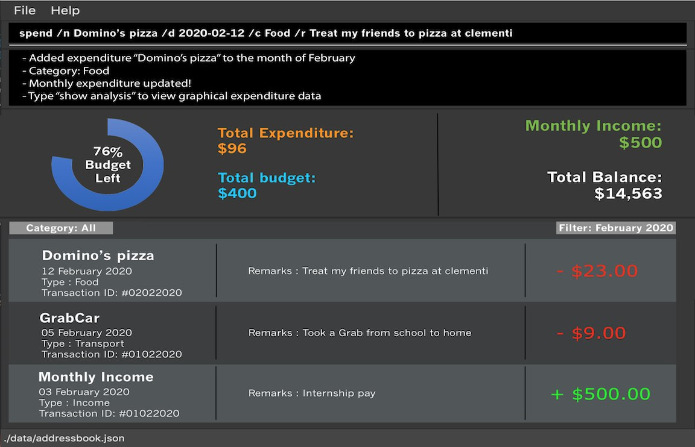

= Delino - User Guide
:site-section: UserGuide
:toc:
:toc-title:
:toc-placement: preamble
:sectnums:
:imagesDir: images
:stylesDir: stylesheets
:xrefstyle: full
:experimental:
ifdef::env-github[]
:tip-caption: :bulb:
:note-caption: :information_source:
endif::[]
:repoURL: https://github.com/AY1920S2-CS2103T-W12-1/main

By: `CS2103T-W12-01`      Since: `Jan 2020`      Licence: `MIT`

== Introduction
This user guide provides in-depth documentation on the Delino desktop application:
quick start guide, features, FAQ, command summary, and glossary.

Delino is for couriers who *prefer to use a desktop app for managing their delivery tasks*.
It is *optimised for those who have a strong preference towards Command Line Interface* (CLI)
while still enjoying the benefits of a Graphical User Interface (GUI).
Sounds interesting? Have a quick look at our tutorial <<Quick Start>> to get started.
Have a delightful journey using Delino!

=== How to navigate this user guide
Throughout this user guide, you might encounter additional symbols. These symbols are used to
highlight important information. +
This user guide uses the following symbols:

[NOTE]
====
This block contains additional *notes*. +
It contains more information regarding complex content that you should take note of.
====

[TIP]
====
This block contains additional *tips*.
====

[WARNING]
====
This block contains *warning* information.
====

[IMPORTANT]
====
This block contains *important* inforamtion that you should be mindful of.
====

You will also encounter the use of `text markup` to indicate keywords such as
command arguments to Delino. (e.g. `exit`)

Finally, you will encounter links to external webpages for additional information.
These links will link:[look like this].

== Quick Start

.  Ensure you have Java `11` or above installed in your Computer.
.  Download the latest `Delino.jar` link:{repoURL}/releases[here].
.  Copy the file to the folder you want to use as the home folder for your Delino.
.  Double-click the file to start the app. The GUI should appear in a few seconds.
+

+
.  Type the command in the command box and press kbd:[Enter] to execute it. +
e.g. typing *`help`* and pressing kbd:[Enter] will open the help window.
.  Some example commands you can try:

* <<list, `list`>> : lists all orders to be delivered.
* <<insert, `insert`>> `tid/1023456789` `n/Amos Cheong` `a/Blk 572 Hougang st 51 #11-37 S530572` `p/9001 0019` `dts/2020-03-10 1650` `w/Marsiling` `cod/$5` `c/Leave it at the riser type/glass` : adds an order where the receiver name is `Amos Cheong` into Delino.
* <<delete, `delete`>> `3` : deletes the 3rd delivery order shown in the current list
* <<exit, `exit`>> : exits the app

.  Refer to <<Features>> for a more detailed explanation of each command.

[[Features]]
== Features

====
*Command Format*

* Words in `UPPER_CASE` are the parameters to be supplied by the user e.g. in `insert n/CUSTOMER_NAME`, `CUSTOMER_NAME` is a parameter which can be used as `insert n/John Doe`.
* Items in square brackets are optional e.g `n/CUSTOMER_NAME [t/TAG]` can be used as `n/John Doe t/friend` or as `n/John Doe`.
* Items with `…`​ after them can be used multiple times including zero times e.g. `[t/TAG]...` can be used as `{nbsp}` (i.e. 0 times), `t/friend`, `t/friend t/family` etc.
* Parameters can be in any order e.g. if the command specifies `n/CUSTOMER_NAME p/PHONE_NUMBER`, `p/PHONE_NUMBER n/CUSTOMER_NAME` is also acceptable.
====

==== Examples

* `insert` `tid/9876543210` `n/John Doe` `a/Blk 572 Hougang st 51 #10-33 S530572` `p/98766789` `e/johndoe@example.com` `dts/2020-02-20 1300` `w/Yishun` `cod/$4`
* `insert` `tid/1023456789` `n/Amos Cheong` `a/Blk 572 Hougang st 51 #11-37 S530572` `e/amoscheong@example.com` `p/9001 0019` `dts/2020-03-10 1650` `w/Marsiling` `cod/$5` `c/Leave it at the riser` `type/glass`

[[clear]]
=== Clearing all entries : `clear`

==== Description
* You can use this command to clear all existing orders. By default, the command will ask you for confirmation.
* If an `-f` flag is given, no user confirmation will be requested.

[NOTE]
====
* Space is required in between the flags and command.
* If *no* `-o` or `-r` flag is given, it will be treated as both. *Both* order book and return order book will be cleared.
====

==== Format:
* `clear` `[FLAG]`

==== Examples
* `clear` +
    Popup will appeared and ask the user for double confirm to clear both order and return order book.
* `clear` `-f` +
    Both order book and return order book will be cleared immediately.
* `clear` `-f` `-r` +
    Only return order book is cleared immediately.
* `clear` `-o` `-f` +
    Only order book is cleared immediately.

[[delete]]
=== Deleting an order : `delete`
==== Description
* You can use this command to delete a particular order from the current list of orders based on its index. +

==== Format:
`delete` `INDEX`

****
* Deletes the order at the specified `INDEX`.
* The index refers to the index number shown in the displayed order list.
* The index *must be a positive integer* 1, 2, 3, ...
****

==== Examples:

* `list` +
`delete` `2` +
Deletes the 2nd order.
* `search` `-n` `Betsy` +
`delete` `1` +
Deletes the 1st order in the results of the `search` command (search all orders with customer's name `Betsy`).

[[delivered]]
=== Mark order as delivered: `delivered`
==== Description
* Once you have completed a delivery order, you can mark an order as done by providing the index of the order list.
* The order that is marked as done will be moved to another list that contains all the orders that are completed.
* The completed list can be seen by calling the list command: `list` `done`.

==== Format
`delivered` `INDEX`

==== Examples
* `delivered` `1` +
The order at the first index of the list is marked as a delivered order.
* `delivered` `2` +
The order at the second index of the list is marked as a delivered order.

[[edit]]
=== Editing an order : `edit`

==== Description

* You can edit the details of the delivery order by providing the index of it shown on the status bar, followed by the field you want to change and lastly the updated value.

==== Format

[TIP]
====
* Use the <<list, `list`>> command to see which delivery order you want to edit.
* List of order attribute prefixes can be found <<command_prefix, here>>.
====

* `edit` `INDEX` `ORDER_ATTRIBUTE_PREFIX/NEW_VALUE` `[ORDER_ATTRIBUTE_PREFIXES/NEW_VALUE]...`

[WARNING]
====
* The `INDEX` *must be a positive integer*, e.g: 1, 2, 3, ...
* The `INDEX` *must be in range* of the number of displayed orders
* Only can be used when there is at least an order displayed.
====

****
* Edits the order at the specified `INDEX`.
* Existing value that corresponds to the `PREFIX` will be updated to the input `NEW_VALUE`.
****

==== Examples

* `edit` `1` `n/Xuan En` +
The index `1` customer's name is changed to `Xuan En`.
* `edit` `2` `p/9999 4444` +
The index `2` customer's phone number is changed to `9999 4444`.
* `edit` `1` `a/Blk 123 Pasir Ris Street 51 #12-21 S510123` +
The index `1` customer's address is changed to `Blk 123 Pasir Ris Street 51 #12-21 S510123`.
* `edit` `3` `n/Mr Tan` `p/0123 4567` `a/Blk 141 Yishun st 71 #09-09 S760141` +
The index `3` customer's name, phone and address are changed accordingly to the prefix.

[[exit]]
=== Exiting the program : `exit`

==== Description
* You can exit the application using the exit command.

==== Format:
* `exit`

[[help]]
=== Viewing help : `help`

==== Description
* You can use the help command to display all commands that are available to be used
so that you can navigate the application easily.

==== Format:
* `help`

==== Examples:
* `help` +
Returns a list of all commands available.

[[show]]
=== Show statistics : `show`

==== Description
* You can use the show command to open a new window to display statistics of the orders assigned to the courier.
It shows the earnings the courier has made today, the number of orders delivered and the total number of orders
he or she has to deliver today. The statistics include a PieChart at the bottom, which shows the percentage of
delivered orders compared to the undelivered ones.

==== Format:
* `show`

==== Examples:
* `show` +
Opens a new window that contains the statistics.

[[insert]]
=== Inserting an order: `insert`

==== Description
* Inserts a new order to the list of orders based on their order attributes.

==== Format
* `insert` `tid/TRANSACTION_ID` `n/CUSTOMER_NAME` `a/ADDRESS` `p/PHONE_NUMBER` `e/EMAIL` `dts/DELIVERY_DATE_&_TIME` `w/WAREHOUSE_LOCATION` `cod/CASH_ON_DELIVERY` `[c/COMMENTS_BY_CUSTOMER]` `[type/TYPE_OF_ITEM]`

[TIP]
====
* List of order attribute prefixes can be found <<command_prefix, here>>.
====

[[import]]
=== Importing a list of orders : `import`
==== Description
* You will be able to import orders via csv file that are given to you by your company.
* The CSV file will include all relevant and important details of the parcels; such as the customers’ names,
transaction id of the parcels and the address of the customers, etc.

==== Format
* `import` `FILE_NAME`

[WARNING]
====
* Only csv file could be imported.
* Only *one* csv file can be imported at one time.
* The `FILE_NAME` should include the extension. For example: `*orders.csv*`.
* The folder, *data*, which the csv files are stored should be at the same directory as the JAR file.
* Import the specific csv with the `FILE_NAME` in *data* folder to the application.
====

* The data in the `csv file` should be written in the following format:

[format=csv]
.Order data format
|===
ot/ORDER_TYPE, tid/TRANSACTION_ID, n/NAME, a/ADDRESS, p/PHONE_NUMBER, e/EMAIL, dts/DELIVERY_DATE_&_TIME, w/WAREHOUSE_LOCATION, cod/CASH_ON_DELIVERY, [c/COMMENTS_BY_CUSTOMER], [type/TYPE_OF_ITEM]
|===
* Examples:
** `ot/order`,`tid/1023456789`,`n/Amos Cheong`,`a/Blk 572 Hougang st 51 #11-37 S530572`,`p/90010019`,
`e/amos@example.com`, `dts/2020-03-10 1650`,`w/Marsiling`,`cod/$9.50`,`c/Leave it at the riser`,`type/glass`

[format=csv]
.Return data format
|===
ot/ORDER_TYPE,tid/TRANSACTION_ID, n/NAME, a/ADDRESS, p/PHONE_NUMBER, e/EMAIL rts/RETURN_DATE_&_TIME, w/WAREHOUSE_LOCATION, [c/COMMENTS_BY_CUSTOMER], [type/TYPE_OF_ITEM]
|===

* Examples:
** `ot/return`,`tid/b1230512`,`n/Aaron Teo`,`a/256 Alpha Road #03-22 S123567`,`p/91230456`, `e/aaron@example.com` +
`rts/12-12-2020 1400`,`w/Jurong Warehouse`,`c/Leave it at the lobby`,`type/metal`

* Note:
** Commas `,` are required in between of the different fields.
** Prefixes are required before any value for that field.
** `ORDER_TYPE` can only be either `order` or `return`.
** Only `COMMENTS_BY_CUSTOMER` and `TYPE_OF_ITEM` are optional.

==== Examples

* `import` `orders.csv` +
Import the contents of the csv file, `orders.csv`, to Delino.

[[list]]
=== Listing orders : `list`

==== Description
* You can view the list of delivery orders using the `list` command.
* The list command can be used with different `KEYWORD` to display all the orders with the specific status (done or undone).
* There are three types of list commands that are shown in the examples below.

==== Format
`list` `[KEYWORD]`

[IMPORTANT]
====
* `KEYWORD` can only be either `done` or `undone`.
====

==== Examples
* `list` +
List down all the orders, regardless of whether its completed or incomplete.
* `list` `done` +
List down all the orders that are completed.
* `list` `undone` +
List down all the orders that are uncompleted.

[[nearby]]
=== View orders located at the same area or postal sector: `nearby`
==== Description
There are two possible search criteria for the `nearby` command:

. By *postal sector*: +
Command Usage: `nearby` `POSTAL_SECTOR`

[NOTE]
====
A *postal sector* refers to the first *two* digits of a six digit Singapore postal code.
====
* You can view the orders at a specified Singapore *postal sector*.
* The general location for the order will be identified if a valid postal sector is given.
* The list of postal sectors and their corresponding general locations can be found
https://www.ura.gov.sg/realEstateIIWeb/resources/misc/list_of_postal_districts.htm[here].

.Postal Sectors in Singapore
|===
|Postal Sector |General Location

|01, 02, 03, 04, 05, 06 |Raffles Place, Cecil, Marina, People's Park
|07, 08 |Anson, Tanjong Pagar
|14, 15, 16 |Queenstown, Tiong Bahru
|09, 10 |Telok Blangah, Harbourfront
|11, 12, 13 |Pasir Panjang, Hong Leong Garden, Clementi New Town
|17 |High Street, Beach Road (part)
|18, 19 |Middle Road, Golden Mile
|20, 21 |Little India
|22, 23 |Orchard, Cairnhill, River Valley
|24, 25, 26, 27 |Ardmore, Bukit Timah, Holland Road, Tanglin
|28, 29, 30 |Watten Estate, Novena, Thomson
|31, 32, 33 |Balestier, Toa Payoh, Serangoon
|34, 35, 36, 37 |Macpherson, Braddell
|38, 39, 40, 41 |Geylang, Eunos
|42, 43, 44, 45 |Katong, Joo Chiat, Amber Road
|46, 47, 48 |Bedok, Upper East Coast, Eastwood, Kew Drive
|49, 50, 81 |Loyang, Changi
|51, 52 |Tampines, Pasir Ris
|53, 54, 55, 82 |Serangoon Garden, Hougang, Punggol
|56, 57 |Bishan, Ang Mo Kio
|58, 59 |Upper Bukit Timah, Clementi Park, Ulu Pandan
|60, 61, 62, 63, 64 |Jurong
|65, 66, 67, 68 |Hillview, Dairy Farm, Bukit Panjang, Choa Chu Kang
|69, 70, 71 |Lim Chu Kang, Tengah
|72, 73 |Kranji, Woodgrove
|77, 78 |Upper Thomson, Springleaf
|75, 76 |Yishun, Sembawang
|79, 80 |Seletar
|===

[start=2]
. By *area*: +
Command Usage: `nearby` `AREA`

[NOTE]
====
An *area* refers to one of the five areas of Singapore +

. Central
. East
. North East
. West
. North

A quick reference for the five areas of Singapore can be <<area_table, found here>>
====
* You can view all the orders located at a specified *area*.

You can obtain more detailed information about each area from
https://keylocation.sg/singapore/districts-map[this website]

==== Format
. `nearby` `POSTAL_SECTOR` +

[IMPORTANT]
====
`POSTAL_SECTOR` is the first *two* digits of a six digit Singapore postal code +
Example: The postal code `140239` has a `POSTAL_SECTOR` of `14`
====

[start=2]
. `nearby` `AREA`

==== Examples
* `nearby` `14` +
You will view all orders located in the general location of `Queenstown, Tiong Bahru`.
* `nearby` `04` +
You will view all orders located in the general location of `Raffles Place, Cecil, Marina, People's Park`.
* `nearby` `north` +
You will view all orders located in the north area of Singapore.

[[return]]
=== Returning an order: `return`
==== Description
* Adds a particular order as a return parcel into a new list.

==== Format
`return` `tid/TRANSACTION_ID` `n/CUSTOMER_NAME` `a/ADDRESS` `p/PHONE NUMBER` `rts/RETURN_DATE_&_TIME` `w/WAREHOUSE_LOCATION` `[c/COMMENTS_BY_CUSTOMER]` `[type/TYPE_OF_ITEM]`

[TIP]
====
* List of order attribute prefixes can be found <<command_prefix, here>>.
====

==== Examples:
* `return` `tid/ac17s2a` `n/Bobby Tan` `a/123 Delta Road #03-333, Singapore 123456` `p/91230456` `e/bobby@example.com` `rts/12-12-2020 1300` `w/Jurong Warehouse` `c/NIL` `type/glass` +
Adds the order with transaction id 'ac17s2a' as a return parcel into the list of returns.

* `return` `tid/b1230512` `n/Aaron Teo` `a/256 Alpha Road #03-222, Singapore 123567` `p/91230456` `e/aaron@example.com` `rts/12-12-2020 1400` `w/Jurong Warehouse` `c/Leave it at the lobby` `type/metal` +
Adds the order with transaction id 'b1230512' as a return parcel into the list of returns.

[[search]]
=== Locating orders by order fields: `search`

==== Description

* You can search all orders that contain a given keyword.
* By default, `search` finds all orders that contain the given keyword(s) in any of it's field.
* Specific search can be performed by tagging keywords that you want to search for with the corresponding <<command_prefix,`ORDER_ATTRIBUTE_PREFIX`>>.

==== Format
* `search` `KEYWORD` `[MORE_KEYWORDS]...` OR
* `search` `<<command_prefix, ORDER_ATTRIBUTE_PREFIX>>/KEYWORD` `[MORE_KEYWORDS]...` `[<<command_prefix, ORDER_ATTRIBUTE_PREFIX>>/KEYWORD/KEYWORD MORE_KEYWORDS]...`

****
* The search is case insensitive. e.g `hans` will match `Hans`
* The sequence of the keywords does not matter. e.g. `Hans Bo` will match `Bo Hans`
* The delivery orders can only be searched by any fields of the orders.
* Only full words will be matched e.g. `Han` will not match `Hans`
* Orders matching at least one keyword will be returned (i.e. `OR` search). e.g. `Hans Bo` will return `Hans Gruber`, `Bo Yang`
****

==== Examples
* `search` `Jeremy Loh` +
Return delivery order(s) containing keyword of `jeremy`, `Jeremy Loh` or `loh` or any of the above as long as it appears in any of the orders field.
* `search` `tid/asj2od3943` +
Return delivery order(s) with transaction ID of `asj2od3943`
* `search` `p/92039999` +
Return delivery order(s) with phone number of `92039999`
* `search` `p/92039999` `tid/asj2od3943` `n/jeremy` +
Return delivery order(s) with either phone number of `92039999` or transaction ID of `asj2od3943` or name of `jeremy` or any of the above combinations.

[[undo]]
=== Undo the previous action: `undo`
==== Description
* You can use the `undo` command to revert the most recent action that was previously executed.
* For example, if you accidentally deleted an order, you can use the `undo` command to add the deleted order
back to the list of orders.

==== Format
`undo`

==== Example
* `list` +
`delete` `1` +
`delete` `2` +
`undo` +
The list will be reverted back to the state after the second command `delete` `1`.

=== Saving the data
==== Description
* Data is saved in the hard disk automatically after any command that changes data that is present.
* There is no need to save manually.

=== Export order list `[coming in v2.0]`
_{explain how the user can export their order list as csv file to pass the orders to their colleagues}_

=== Reminder `[coming in v2.0]`
_{explain how the user can set reminder specifically for orders that are rescheduled or urgent orders}_

=== Rescheduling orders `[coming in v2.0]`
_{explain how the user can reschedule their orders when customers notify them that they are unavailable for receiving orders}_

=== Keeping track of work schedule `[coming in v2.0]`
_{explain how the user can keep track of their work schedule}_

=== Statistics for completed orders `[coming in v2.0]`
_{explain how the user can view statistics such as on-time rates (difference between actual and expected
delivery), number of deliveries completed in a day}_

== FAQ

*Q*: How do I transfer my data to another Computer? +
*A*: Install the app in the other computer and overwrite the empty data file it creates with the file that contains the data of your previous Address Book folder.

== Command Summary

* <<insert, *Insert*>> : `insert` `tid/TRANSACTION_ID` `n/CUSTOMER_NAME` `a/ADDRESS` `p/PHONE_NUMBER` `e/E,MAIL` `dts/DELIVERY_DATE_&_TIME` `w/WAREHOUSE_LOCATION` `cod/CASH_ON_DELIVERY` `[c/COMMENTS_BY_CUSTOMER]` `[type/TYPE_OF_ITEM]` +
e.g. `insert` `tid/0123456789` `n/Eng Xuan En` `a/Tampines St 84 Blk 877 S520877 #01-123` `p/87654321` `e/xuanen@example.com` `dts/2020-02-20 1300` `w/Yishun industry` `cod/$4.50` `c/please knock the door three times :D` `type/heavy`
* <<clear, *Clear*>> : `clear` `[FLAG]` +
e.g. `clear` `-f`
* <<delete, *Delete*>> : `delete` `INDEX` +
e.g. `delete` `2`
* <<delivered, *Delivered*>> : `delivered` `INDEX` +
e.g. `delivered` `2`
* <<edit, *Edit*>> : `edit` `INDEX` `ORDER_ATTRIBUTE_PREFIX/VALUE` +
e.g. `edit` `2` `n/Xuan En`
* <<exit, *Exit*>> : `exit`
* <<search, *Search*>> : `search` `ORDER_ATTRIBUTE_PREFIX/KEYWORD` +
e.g. `search` `tid/ac1e345x7s`
* <<help, *Help*>> : `help`
* <<show, *Show*>> : `show`
* <<import, *Import*>> : `import` `FILE_NAME` +
e.g. `import` `orders.csv`
* <<list, *List*>> : `list` `[DONE_STATUS]` +
e.g. `list` `done`
* <<return, *Return*>> : `return` `tid/TRANSACTION_ID` `n/CUSTOMER_NAME` `a/ADDRESS` `p/PHONE_NUMBER` `e/EMAIL` `rts/RETURN_DATE_&_TIME` `w/WAREHOUSE_LOCATION` `c/COMMENTS_BY_CUSTOMER` `type/TYPE_OF_ITEM` +
e.g. `return` `tid/ac17s2a` `n/BOBBY TAN` `a/123 Delta Road #03-333, Singapore 123456` `p/91230456` `rts/12-12-2020 1301` `w/Jurong Warehouse` `c/NIL` `type/glass`
* <<nearby, *Nearby*>> : `nearby` `POSTAL_SECTOR` or `nearby` `AREA` +
e.g. `nearby` `14` +
e.g. `nearby` `north`
* <<undo, *Undo*>> : `undo`

== Appendix A: Glossary

[[command_prefix]]
.Command Prefix
|===
|Prefix |Meaning |Used in the following Command(s)

|ot/
|Order Type
|<<import, Import>>

|tid/
|Transaction ID
|<<edit, Edit>>, <<insert, Insert>>, <<return, Return>>, <<search, Search>>

|n/
|Customer Name
|<<edit, Edit>>, <<insert, Insert>>, <<return, Return>>, <<search, Search>>

|a/
|Address
|<<edit, Edit>>, <<insert, Insert>>, <<return, Return>>, <<search, Search>>

|p/
|Phone Number
|<<edit, Edit>>, <<insert, Insert>>, <<return, Return>>, <<search, Search>>

|e/
|Email
|<<insert, Insert>>, <<edit, Edit>>, <<return, Return>>, <<search, Search>>

|dts/
|Delivery Date And Time
|<<edit, Edit>>, <<insert, Insert>>, <<return, Return>>, <<search, Search>>

|rts/
|Return Date and Time
|<<return, Return>>, <<search, Search>>

|w/
|Warehouse Location
|<<edit, Edit>>, <<insert, Insert>>, <<return, Return>>, <<search, Search>>

|cod/
|Cash On Delivery
|<<edit, Edit>>, <<insert, Insert>>, <<search, Search>>

|c/
|Comments by Customer
|<<edit, Edit>>, <<insert, Insert>>, <<return, Return>>, <<search, Search>>

|type/
|Type of Item
|<<edit, Edit>>, <<insert, Insert>>, <<return, Return>>, <<search, Search>>
|===

[[command_flags]]
.Possible Command Flags
|===
|Flag |Meaning |Used in the following Command(s)

|-f
|Force clear, no user confirmation will be requested
|<<clear, Clear>>

|-o
|Order flag, Operation on order list
|<<clear, Clear>>

|-r
|Return Order flag, Operation on return order list
|<<clear, Clear>>
|===

[[area_table]]

=== Area Information of Singapore

<<nearby, Click here>> to navigate back to the Nearby Command!

.Central
|===
|District |Areas |Location

|1 |Marina Area
a|
* Boat Quay
* Chinatown
* Havelock Road
* Marina Square
* Raffles Place
* Suntec City

|2 |CBD
a|
* Anson Road
* Chinatown
* Neil Road
* Raffles Place
* Shenton Way
* Tanjong Pagar

|3 |Central South
a|
* Alexandra Road
* Tiong Bahru
* Queenstown

|4 |Keppel
a|
* Keppel
* Mount Faber
* Sentosa
* Telok Blangah

|5 |South West
a|
* Buona Vista
* Dover
* Pasir Panjang
* West Coast

|6 |City Hall
a|
* City Hall
* High Street
* North Bridge Road

|7 |Beach Road
a|
* Beach Road
* Bencoolen Road
* Bugis
* Rochor

|8 |Little India
a|
* Little India
* Farrer Park
* Serangoon Road

|9 |Orchard
a|
* Cairnhill
* Killiney
* Leonie Hill
* Orchard
* Oxley

|10 |Tanglin
a|
* Balmoral
* Bukit Timah
* Grange Road
* Holland
* Orchard Boulevard
* River Valley
* Tanglin Road

|11 |Newton
a|
* Chancery
* Bukit Timah
* Dunearn Road
* Newton

|12 |Toa Payoh
a|
* Balestier
* Moulmein
* Novena
* Toa Payoh

|13 |Central East
a|
* Potong Pasir
* Macpherson

|14 |Eunos
a|
* Eunos
* Geylang
* Kembangan
* Paya Lebar

|15 |East Coast
a|
* Katong
* Marine Parade
* Siglap
* Tanjong Rhu

|21 |Central West
a|
* Clementi
* Upper Bukit Timah
* Hume Avenue
|===

.East +
|===
|District |Areas |Location

|16 |Upper East Coast
a|
* Bayshore
* Bedok
* Chai Chee

|17 |Far East
a|
* Changi
* Loyang
* Pasir Ris

|18 |Tampines
a|
* Pasir Ris
* Simei
* Tampines
|===

.North East
|===
|District |Areas |Location

|19 |North East
a|
* Hougang
* Punggol
* Sengkang

|20 |Ang Mo Kio
a|
* Ang Mo Kio
* Bishan
* Braddell Road
* Thomson

|28 |North East
a|
* Seletar
* Yio Chu Kang
|===

.West
|===
|District |Areas |Location

|22 |Far West
a|
* Boon Lay
* Jurong
* Tuas

|23 |North West
a|
* Bukit Batok
* Choa Chu Kang
* Hillview Avenue
* Upper Bukit Timah

|24 |Far North West
a|
* Kranji
* Lim Chu Kang
* Sungei Gedong
* Tengah
|===

.North
|===
|District |Areas |Location

|25 |Far North
a|
* Admiralty
* Woodlands

|26 |North
a|
* Tagore
* Yio Chu Kang

|27 |Far North
a|
* Admiralty
* Sembawang
* Yishun
|===
