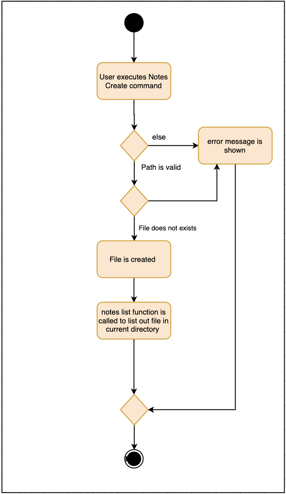

.Component interactions for `moduleAdd m/CS2103T` command
image::../images/ArchitectureSequenceDiagram.png[width="790"]

Shows how the components interact for each of the commands implemented in NUSProductivity

.Structure of the UI Component
image::../images/UiClassDiagram.png[width="790"]

Shows the UI component of NUSProductivity

.Calender UI Class Diagram
image::../images/CalenderUIClassDiagram.png[]

Shows the class diagram and relationship between the different UI.

.Add task sequence diagram
image::../images/AddTaskSequenceDiagram.png[]

Shows how a deadlineAdd interacts with the different components in the program.

.Calendar Activity Diagram
image::../images/CalendarActivityDiagram.png[]

Shows the activity diagram of all calendar feature commands and how it interacts with the UI.

.Notes Open Sequence Diagram
image::../images/notesOpenSequenceDiagram.png[width="600"]

Shows the sequence diagram of a notesCommand

.Notes List Activity Diagram

.Notes Open Activity Diagram

Shows the activity diagram when a notesOpen or notesList is executed.